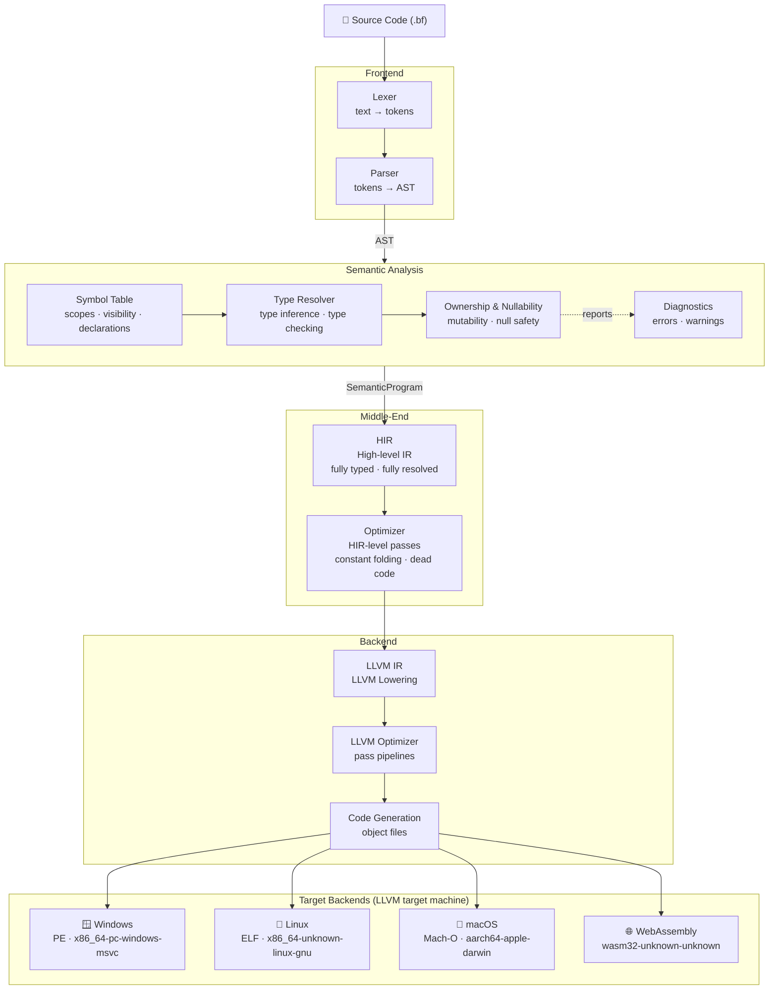

# ByteFrost
ByteFrost is a compiled programming language with simplicity and safety in mind. It's name is inspired in Norse mythology `Bifröst` often described as a bridge between Midgard and Asgard. Likewise ByteFrost can be seen as bridge between users (developers, Midgard) and the machine (godlike performance, Asgard).

## Compiler architecture
The ByteFrost compiler is a pipeline of multiple layers to provide simplicity, consistency, safety and performance.  

At a high level the compiler looks like:

